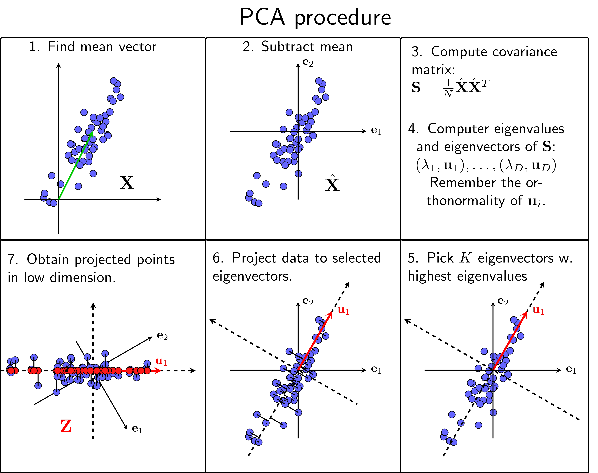

# PCA_face_detection

**PCA (Principal Component Analysis)** is the simplest of the Dimensionality Reduction algorithms based on a linear model. This method is based on the observation that data are not usually randomly distributed in space but are usually distributed near certain special lines/surfaces. PCA considers a special case where those special surfaces are linear in form, called subspaces.
The simplest way to reduce the dimensionality of the data from D to K < D is to keep only the K most important elements. However, this is certainly not the best way to do it because we do not know which element is more important. Or in the worst case, the amount of information that each element carries is the same, removing any element will lead to the loss of a large amount of information.
However, if we can represent the original data vectors in a new basis system in which the importance of the components is clearly different, then we can ignore the least important components.
PCA is a method of finding a new basis system so that the information of the data is mainly concentrated in a few coordinates, the rest only carries a small amount of information. And to simplify the calculation, PCA will find an orthonormal system to be the new basis.

> [!NOTE]
> ## Steps to perform PCA Algorithim:
1. Calculate the expectation vector of the entire data 
2. Subtract each data point from the expected vector of the entire data 
3. Calculate the covariance matrix
4. Calculate eigenvalues ​​and eigenvectors from the covariance matrix.
5. Sort the eigenvectors in descending order of eigenvalues
6. Select K eigenvectors corresponding to the K largest eigenvalues ​​to construct a matrix Uk whose columns form an orthogonal system. These K vectors, also called principal components, form a subspace that closely approximates the distribution of the original normalized data.
7. Project the data onto the new PCA space, creating a weight matrix.

Read more: [Machine Learning co ban](https://machinelearningcoban.com/2017/06/15/pca)

## Build PCA for Face Detection
In this project, I used PCA to reduce the dimensionality of facial image data, then searches for similarities between new faces and the training set (known images) using Euclidean distance.
